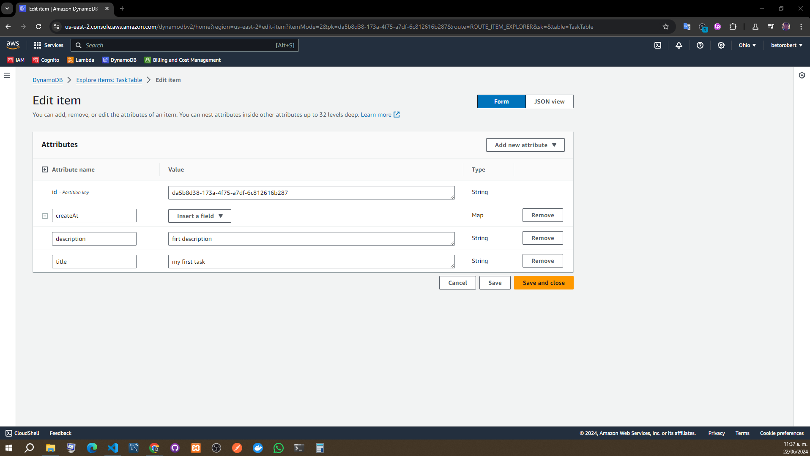

# AWS Lambda & DynamoDB CRUD | Serverles Framework con Nodejs y AWS

-Author: Fazt

Video: [AWS Lambda & DynamoDB CRUD | Serverles Framework con Nodejs y AWS](https://www.youtube.com/watch?v=wvux4WOU5dc&t=3942s)

## Introducción

En este tutorial aprenderás a crear un CRUD utilizando AWS Lambda y DynamoDB con el framework Serverless y Node.js. Este proyecto es útil para aquellos que desean aprender sobre el desarrollo de aplicaciones sin servidor (serverless).

## Requisitos

- Node.js instalado en tu sistema.
- Una cuenta de AWS.
- Conocimientos básicos de JavaScript y Node.js.

## Instalación del Framework Serverless

Primero, debemos instalar el framework Serverless de manera global en nuestro sistema:

```bash
serverless (Delete when you had information about ) Permite crear nuestras funciones localmente
```

Primero nos autenricamos en aws osea iniciamos sesion
Servios a utilizar -->

  -IAM -->Para crear roles de usuario, creamos un usuario
  -Lambda ---> To upload fuctions
  -Dynamo --> To save data

```bash
Instalamos aws clic (Search command)
En la pagina aws clic podemos bajar un ejecutable
```

Selecciona el template de AWS Node.js y sigue las instrucciones para configurar tu proyecto.

## Configuración de AWS Credentials

Para configurar tus credenciales de AWS, utiliza el comando:

```bash
serverless config credentials --provider aws --key TU_ACCESS_KEY --secret TU_SECRET_KEY
```

Creación de la Función Lambda

Vamos a crear una función Lambda que manejará nuestras operaciones CRUD. En el archivo serverless.yml, define tu función de la siguiente manera:

```yml
functions:
  create:
    handler: handler.create
    events:
      - http:
          path: create
          method: post
```

### El archivo handler.js debe contener la lógica de tu función

```javascript
'use strict';

const AWS = require('aws-sdk');
const uuid = require('uuid');

const dynamoDb = new AWS.DynamoDB.DocumentClient();

module.exports.create = async (event) => {
  const timestamp = new Date().getTime();
  const data = JSON.parse(event.body);

  const params = {
    TableName: process.env.DYNAMODB_TABLE,
    Item: {
      id: uuid.v1(),
      text: data.text,
      checked: data.checked,
      createdAt: timestamp,
      updatedAt: timestamp,
    },
  };

  try {
    await dynamoDb.put(params).promise();
    return {
      statusCode: 200,
      body: JSON.stringify(params.Item),
    };
  } catch (error) {
    console.error(error);
    return {
      statusCode: 500,
      body: JSON.stringify({ error: 'Could not create item' }),
    };
  }
};
```

## Creación de la Tabla DynamoDB

En el archivo serverless.yml, añade la configuración para crear una tabla DynamoDB:}

```yml
resources:
  Resources:
    TodosTable:
      Type: 'AWS::DynamoDB::Table'
      Properties:
        TableName: ${self:provider.environment.DYNAMODB_TABLE}
        AttributeDefinitions:
          - AttributeName: id
            AttributeType: S
        KeySchema:
          - AttributeName: id
            KeyType: HASH
        ProvisionedThroughput:
          ReadCapacityUnits: 1
          WriteCapacityUnits: 1
```

## Despliegue del Proyecto

Para desplegar tu proyecto, utiliza el comando:

```bash
serverless deploy
```

## Prueba de la Función

Para probar la función Lambda, puedes utilizar herramientas como Postman o realizar una petición HTTP desde tu navegador o terminal:

```bash
curl -X POST https://tu-api-id.execute-api.region.amazonaws.com/dev/create --data '{ "text": "Learn Serverless", "checked": true }'
```

## Conclusión

En este tutorial, has aprendido cómo crear un CRUD utilizando AWS Lambda y DynamoDB con el framework Serverless y Node.js. Ahora puedes expandir este proyecto añadiendo más funciones y optimizando tu aplicación serverless.

bash

```bash
npm install -g serverless
```

## Algunos comandos que se utilizaron

```bash
aws --version
aws configure
Copied
npm i serverless -g
pwd
cd desktop
serverless
aws --version
serverless
cd aws-lambda-crud-node
code .
npm i
serverless deploy --verbose
aws configure
serverless deploy --verbose
sls deploy --verbose
bash
sls --version
serverless deploy --verbose
git status
sls --version
npm i uuid
npm audit fix
npm i uuid
npm init -y
npm i
npm i uuid
npm i aws-sdk
serverless deploy --verbose
git init
gh repo create aws-lambda-crud-node --public --source=.
add .
git add .
git commit -m "AWS Lambda & DynamoDB CRUD | Serverles Framework con Nodejs y AWS"
git push
git branch -M main
git push
git push -u origin main
serverless deploy --verbose```

### Explicación de comandos

- `aws --version`: Verifica la versión de AWS CLI instalada.
- `aws configure`: Configura las credenciales de AWS.
- `npm i serverless -g`: Instala Serverless Framework de manera global.
- `pwd`: Muestra el directorio de trabajo actual.
- `cd desktop`: Cambia al directorio 'desktop'.
- `serverless`: Verifica la instalación de Serverless Framework.
- `cd aws-lambda-crud-node`: Cambia al directorio del proyecto.
- `code .`: Abre el proyecto en Visual Studio Code.
- `npm i`: Instala las dependencias del proyecto.
- `serverless deploy --verbose`: Despliega el proyecto mostrando detalles del proceso.
- `git init`: Inicializa un repositorio Git.
- `gh repo create aws-lambda-crud-node --public --source=.`: Crea un repositorio público en GitHub y sube el código fuente.
- `git add .`: Añade todos los archivos y cambios al staging area.
- `git commit -m "AWS Lambda & DynamoDB CRUD | Serverles Framework con Nodejs y AWS"`: Hace un commit con el mensaje especificado.
- `git push`: Empuja los cambios al repositorio remoto.
- `git branch -M main`: Cambia el nombre de la rama actual a `main`.
- `git push -u origin main`: Empuja la rama `main` y la establece como la predeterminada para futuras operaciones.





